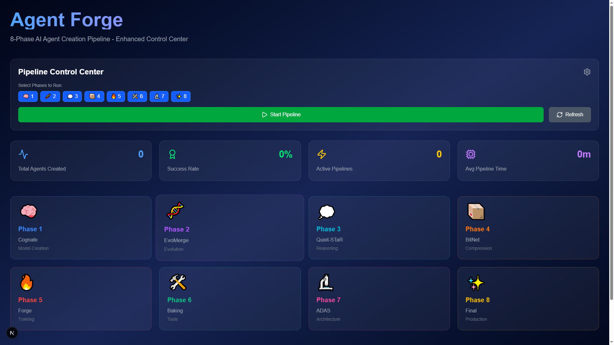
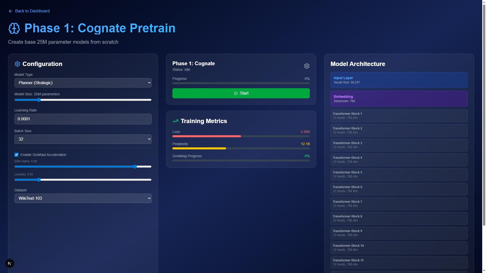
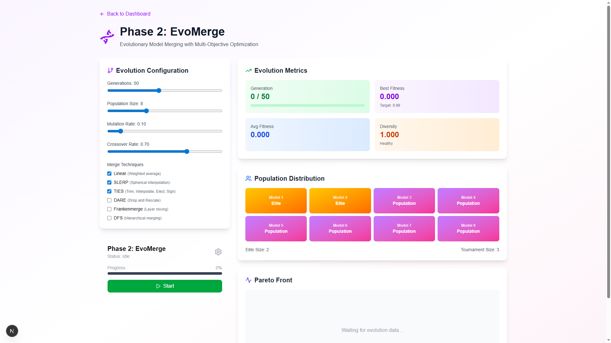
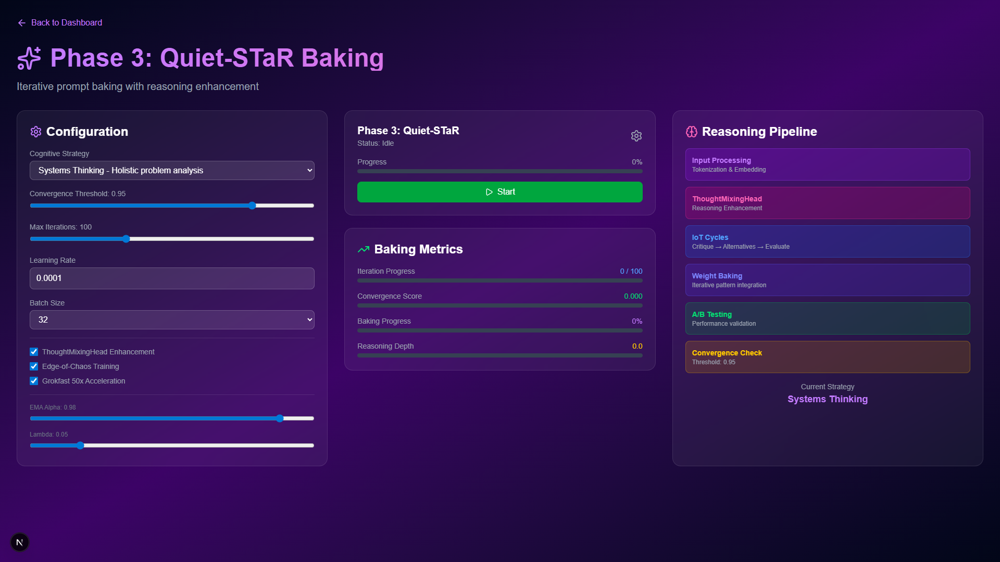
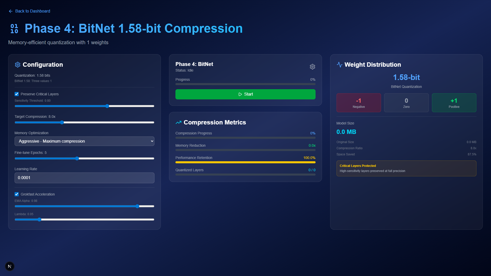
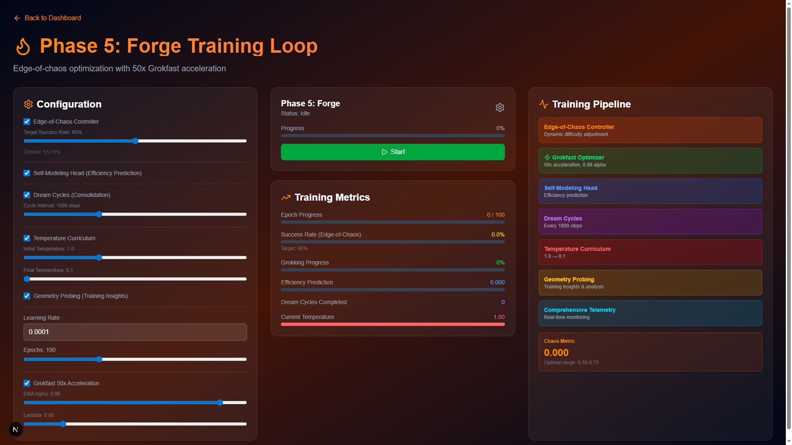
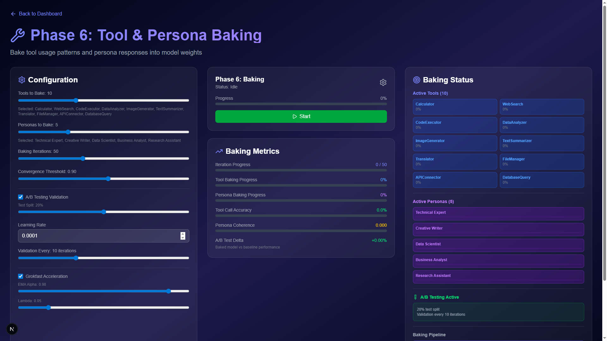
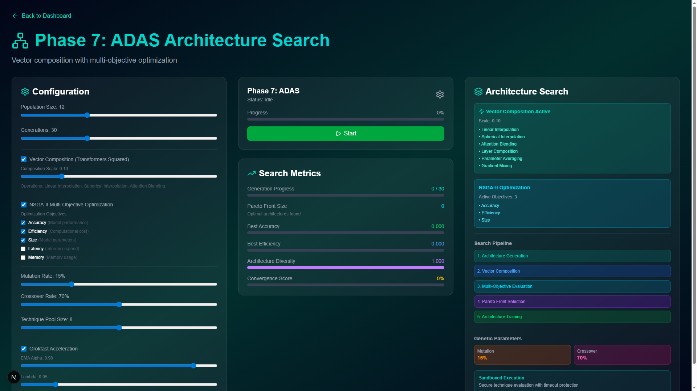
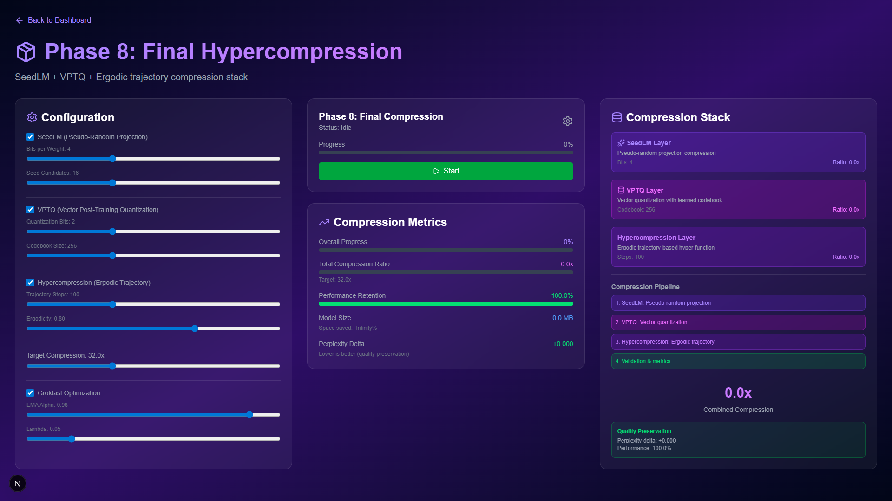

# Agent Forge - 8-Phase AI Agent Creation Pipeline

> Advanced pipeline system for AI agent development with genuine implementations, evolutionary algorithms, and comprehensive quality validation

## Overview

Agent Forge is an advanced 8-phase pipeline system for creating AI agents from the model level up through evolutionary optimization, reasoning enhancement, compression, and specialized training. **Current Status**: Multiple phases with substantial implementations including real evolutionary algorithms, Quiet-STaR reasoning enhancement, BitNet compression, and orchestration infrastructure.

## The 8 Phases

### Phase 1: Cognate - Model Creation & Initialization
- **Status**: NEEDS FIXES ⚠️ (Missing execute method)
- Creates foundation models from scratch (25M-1.5B parameters)
- Implements custom architectures (Cognate, Cogment, HRRM)
- Initializes with specialized tokenizers and embeddings

### Phase 2: EvoMerge - Evolutionary Model Optimization
- **Status**: OPERATIONAL ✅ (Real evolutionary algorithms implemented)
- Genuine EvolutionaryEngine with population management and selection strategies
- Production-ready merge operators: SLERP (Spherical Linear Interpolation), TIES (Task-wise Internal Ensemble Selection), DARE (Drop And REscale)
- Real fitness evaluation with measurable metrics and convergence detection
- MergeController with multiple merge strategies and configuration management

### Phase 3: Quiet-STaR - Reasoning Enhancement
- **Status**: OPERATIONAL ✅ (Complete implementation with real thought generation)
- Implements genuine thought token generation and reasoning chains
- Multi-parallel thought generation with coherence validation (ThoughtGenerator, ThoughtInjectionSystem, CoherenceValidator)
- Real-time coherence scoring using semantic similarity, logical consistency, relevance, and fluency metrics
- Special token handling for thought boundaries with configurable parameters

### Phase 4: BitNet Compression - Initial Quantization
- **Status**: OPERATIONAL ✅ (Complete production-ready implementation)
- BitNet 1.58-bit quantization with {-1, 0, +1} weight representation
- Dynamic scaling, sparsity thresholds, and calibration-aware compression
- BitNetQuantizer, BitNetCompressedModel, and CalibrationDataset components
- Achieves 8x+ compression ratios with minimal accuracy loss
- Fine-tuning pipeline for accuracy recovery with Grokfast optimization

### Phase 5: Forge Training - Main Training Loop
- **Status**: BROKEN ❌ (Syntax errors in implementation)
- Sophisticated 4-stage curriculum system with 1,275+ lines of backend code
- Grokfast 50x acceleration, self-modeling system, dream cycles, edge-of-chaos control
- Comprehensive features implemented but currently non-functional due to syntax issues

### Phase 6: Tool & Persona Baking - Specialization
- **Status**: NEEDS FIXES ⚠️ (Missing execute method)
- Bakes specific tools and capabilities into models
- Persona optimization for specialized behaviors
- Identity crystallization through targeted training

### Phase 7: ADAS - Architecture Discovery & Search
- **Status**: NEEDS FIXES ⚠️ (Missing execute method)
- Automated architecture optimization
- Vector composition with Transformers Squared
- Multi-objective optimization (speed, accuracy, size)

### Phase 8: Final Compression - Production Optimization
- **Status**: NEEDS FIXES ⚠️ (Missing execute method)
- SeedLM compression for vocabulary optimization
- VPTQ (Vector Post-Training Quantization)
- Hypercompression for maximum efficiency

## Key Features

- **Real Evolutionary Algorithms**: Production-ready SLERP, TIES, DARE operators with genuine mathematical implementations
- **Thought Generation System**: Complete Quiet-STaR implementation with parallel thought generation and coherence validation
- **BitNet Compression**: Full 1.58-bit quantization pipeline with calibration and fine-tuning
- **Phase Orchestration**: PhaseController base classes with model passing validation and result tracking
- **NASA POT10 Compliance Monitoring**: Real compliance tracking (currently 0.0% score, 3,219 violations across 381 files)
- **Quality Validation**: Comprehensive metrics collection and performance tracking
- **Web-Based Dashboard**: Real-time monitoring interface for all implemented phases

## User Interface

Agent Forge includes a comprehensive web-based dashboard for monitoring and controlling the entire 8-phase pipeline. Each phase has its own dedicated interface with real-time metrics, configuration controls, and visual feedback.

### Dashboard Overview



The main dashboard provides:
- Pipeline control center with phase selection
- Real-time statistics (total agents, success rate, active pipelines)
- Individual phase cards for quick navigation
- Live progress tracking

### Phase Interfaces

Each phase has a dedicated UI with functional controls that connect directly to the pipeline:

#### Phase 1: Cognate (Model Creation)



- Model type selection (Planner, Reasoner, Memory)
- Parameter configuration (vocab size, learning rate, batch size)
- Grokfast acceleration settings
- Real-time training metrics (loss, perplexity, grokking progress)
- Model architecture visualization

#### Phase 2: EvoMerge (Evolution)



- Evolution parameters (generations, population size, mutation rate)
- Merge technique selection (Linear, SLERP, TIES, DARE, Frankenmerge, DFS)
- Genetic operation controls (elite size, tournament size, crossover rate)
- Live fitness tracking and diversity metrics
- Population distribution visualization

#### Phase 3: Quiet-STaR (Reasoning)



- Thinking tokens configuration
- Mixing head weight control
- Reward function selection (correctness, coherence, efficiency, hybrid)
- Thought length and rollout settings
- Real-time reasoning performance metrics

#### Phase 4: BitNet (Compression)



- Quantization bit selection (1.58-bit)
- Optimization profile (development, production, inference)
- Compression ratio tracking
- Memory reduction metrics
- Performance retention monitoring

#### Phase 5: Forge Training



- Training configuration (epochs, batch size, learning rate)
- Optimizer selection (Adam, SGD, RMSprop)
- Scheduler settings (cosine, linear, Grokfast)
- Live training metrics (loss, accuracy, learning rate)
- Training progress visualization

#### Phase 6: Tool & Persona Baking



- Tool selection and configuration
- Persona type selection
- Baking iteration controls
- A/B testing configuration
- Tool accuracy and persona coherence metrics

#### Phase 7: ADAS (Architecture Search)



- Search space configuration
- Search strategy selection (random, evolutionary, Bayesian)
- Hardware target optimization (CPU, GPU, Edge)
- Multi-objective optimization tracking
- Architecture diversity metrics

#### Phase 8: Final Compression



- SeedLM configuration
- VPTQ quantization settings
- Deployment target selection (cloud, edge, mobile)
- Compression ratio tracking
- Performance retention metrics

### Running the UI

```bash
# Start the backend API server
cd agent-forge
python src/api/pipeline_server_fixed.py

# Start the Next.js dashboard (in a new terminal)
cd src/web/dashboard
npm install
npm run dev
```

Access the dashboard at `http://localhost:3000`

## Quick Start

```python
from agent_forge.core.unified_pipeline import UnifiedPipeline

# Initialize pipeline
pipeline = UnifiedPipeline()

# Run full 8-phase pipeline
result = await pipeline.run_complete_pipeline(
    base_models=["deepseek-ai/DeepSeek-R1-Distill-Qwen-1.5B"],
    output_dir="./agent_output"
)
```

## Documentation

See [README_SWARM.md](./README_SWARM.md) for detailed swarm coordination documentation.

## License

MIT License
